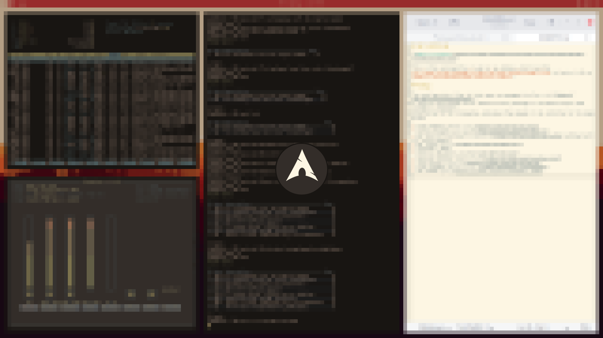

# Dan's Dotfiles

This is the configuration I use for my laptop, which runs the
**[i3-gaps window manager](https://github.com/Airblader/i3)** (a fork of i3) on
**[Arch Linux](https://www.archlinux.org/)**.

## Setup

The configuration files in this repo are managed via [gnu stow](http://www.gnu.org/software/stow/),
a symlink farm manager which takes distinct packages of software and/or data located in separate
directories on the filesystem, and makes them appear to be installed in the same place.

- Linux Distro: [Arch Linux](https://www.archlinux.org/)
- Window Manager: [i3-gaps](https://github.com/Airblader/i3)
- Bar and notifications: [lemonbar](https://github.com/krypt-n/bar) patched with xft fonts support
- Bar Icons: [siji](https://github.com/gstk/siji)
- Launcher: dmenu
- Terminal Emulator: rxvt-unicode-256xresources
- Terminal and bar Font: [tewi](https://github.com/lucy/tewi-font)
- Text Editor: [neovim](https://github.com/neovim/neovim)
- Color Scheme: [erosion-edit](http://dotshare.it/dots/847/)
- GTK Theme: [Arc](https://github.com/horst3180/Arc-theme)
